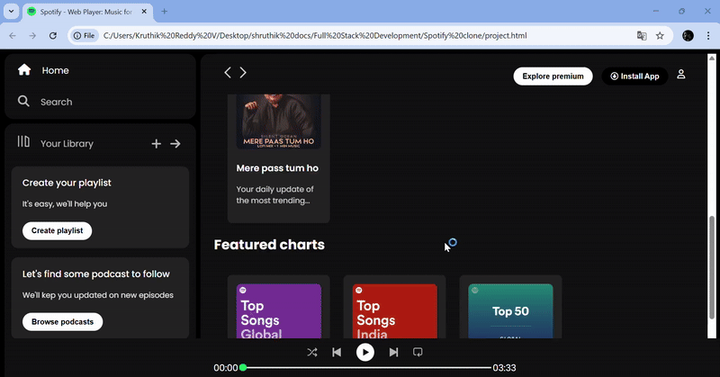
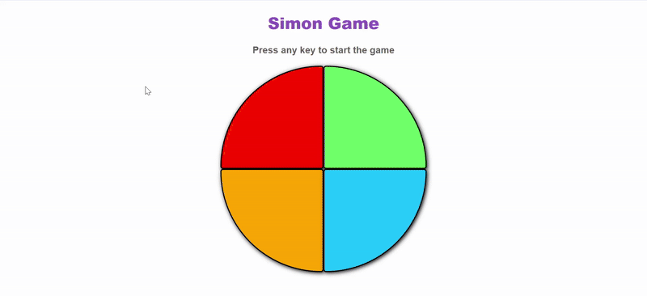
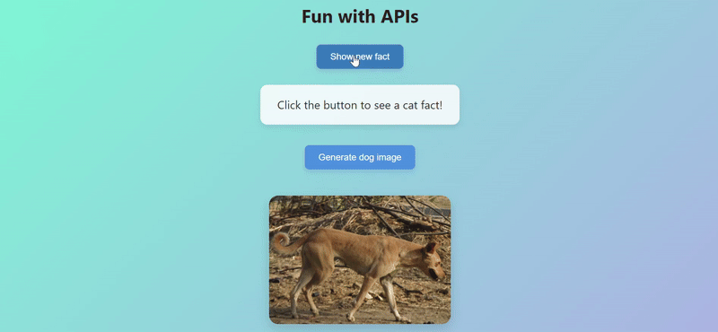

# Simple Micro Projects 🎯

A collection of 5 small, beginner-friendly front-end projects created using HTML, CSS, and JavaScript.  
These projects are great for learning UI design, interactivity, and basic API integration.

---

## 📌 Projects Overview

### 1️⃣ Simple Chat Module 💬
A basic chat interface where users can type and send messages.
- **Focus:** Message display layout, scrollable chat window, and input handling.
- **Tech:** HTML, CSS, JavaScript
  /images/Output.gif)

### 2️⃣ Spotify Clone 🎵
A front-end clone of Spotify's interface.
- **Focus:** Music player UI design, playlist styling, and layout structure.
- **Tech:** HTML, CSS, JavaScript
  

### 3️⃣ Simple Photography Application 📷
A responsive photo gallery web app to showcase images in a clean layout.
- **Focus:** Grid-based design, hover effects, and image presentation.
- **Tech:** HTML, CSS, JavaScript
  

### 4️⃣ Simon Game 🎮
A browser-based version of the classic Simon memory game.
- **Focus:** Game logic, sound effects, and event handling in JavaScript.
- **Tech:** HTML, CSS, JavaScript


### 5️⃣ Fun with APIs 🐶🐱
A project demonstrating API usage with JavaScript `fetch()`.
- **APIs Used:**
  - Random Dog Image API → Displays a random dog image.
  - Cat Fact API → Shows a random cat fact.
- **Extra:** Includes a free APIs list for anyone who wants to create their own fun projects.
- **Tech:** HTML, CSS, JavaScript


---

## 📜 Free APIs List
Here are some free APIs included in **Fun with APIs**:
- **Random Dog Image API:** `https://dog.ceo/api/breeds/image/random`
- **Cat Fact API:** `https://catfact.ninja/fact`
- **Advice Slip API:** `https://api.adviceslip.com/advice`
- **Joke API:** `https://official-joke-api.appspot.com/random_joke`
- **Random User API:** `https://randomuser.me/api/`

---

## 📂 Repository Structure
The repository is organized as follows:
```Simple-Micro-Projects/
│── Simple Chat Module (FrontEnd)/ # Simple chat interface
│── Spotify Clone/ # Front-end Spotify UI
│── Simple Photography-HTML CSS page/ # Responsive photo gallery
│── Simon Game/ # Memory-based Simon game
│── Fun With APIs/ # API integration examples
│── README.md # Project documentation```

---

## 💡 About This Repository
This repository is created to help beginners:
- Learn by building small, focused projects.
- Practice front-end skills with HTML, CSS, and JavaScript.
- Understand and integrate public APIs into projects.

